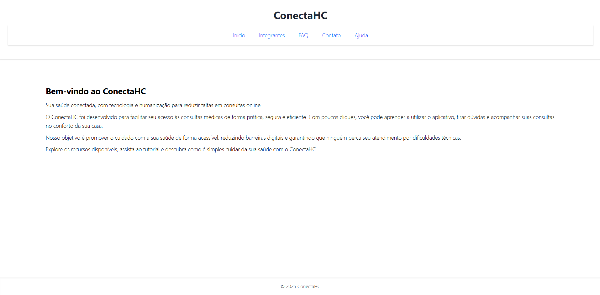
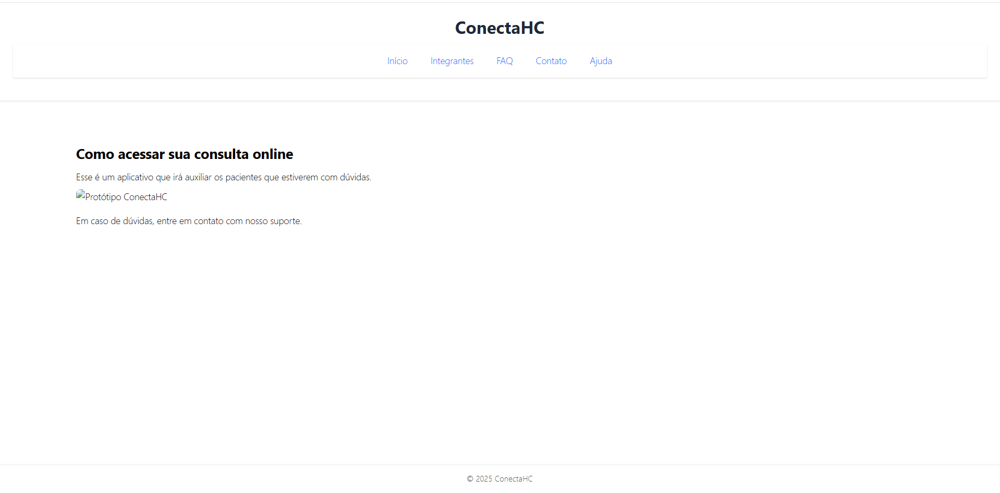
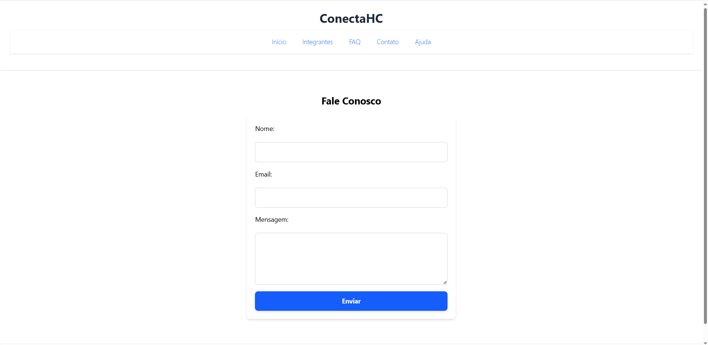
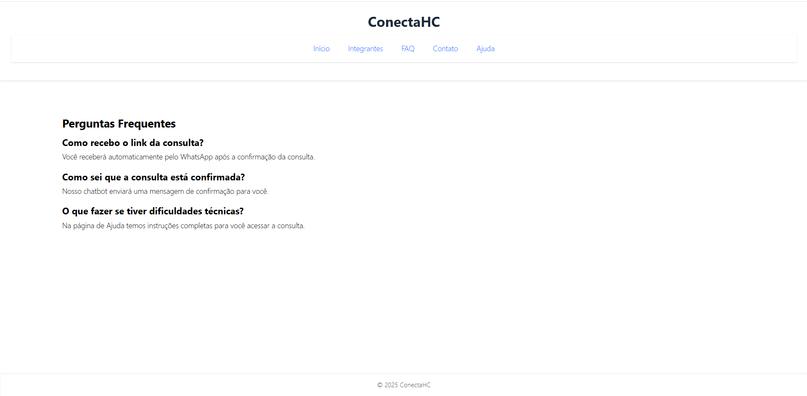
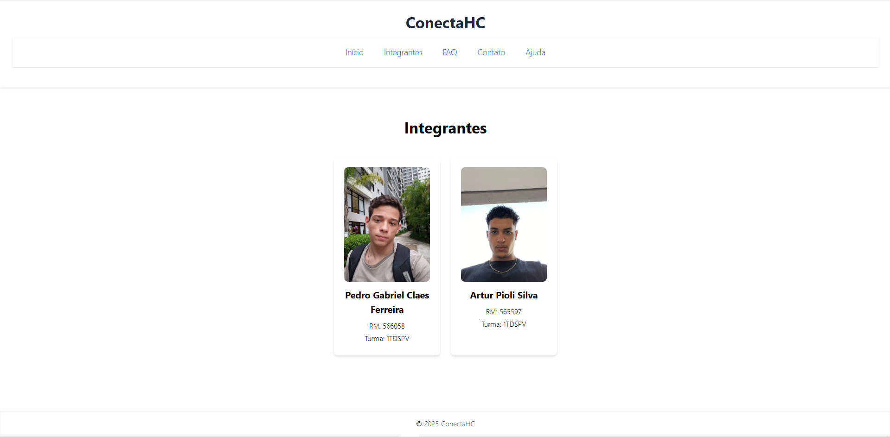

# Projeto Sprint 03 - [Nome do Projeto]

## Tecnologias
- React + Vite + TypeScript
- TailwindCSS
- React Router DOM
- React Hook Form

## Integrantes
- Pedro Gabriel Claes Ferreira (RM: 566058, Turma: 1TDSPV)
- Arthur Pioli (RM: 565597, Turma: 1TDSPV)

## Estrutura de Pastas

## Link GitHub
[Repo](https://github.com/PedroClaes/challange_sprint3)

## Vídeo Demo
[![Vídeo]](https://youtu.be/g1RfyhKLuRc)

## Imagens do Projeto

